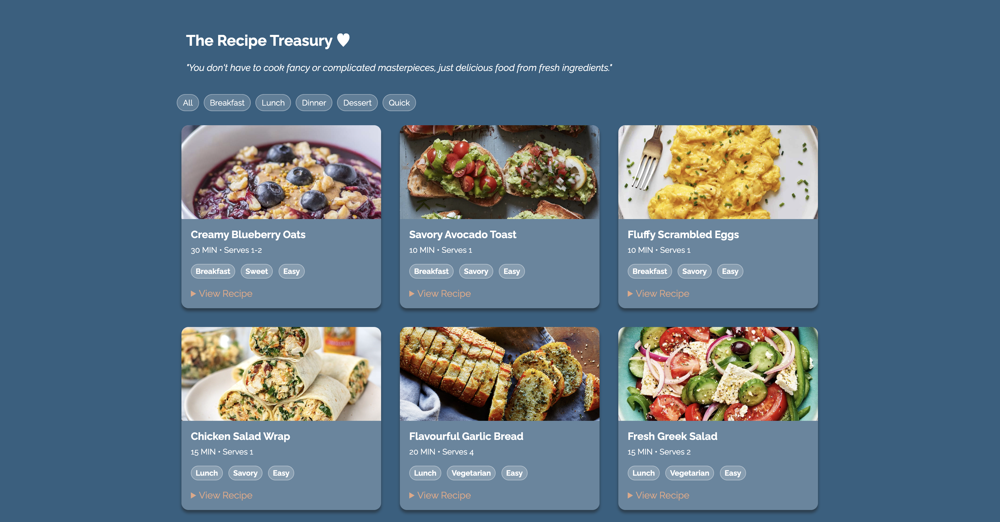
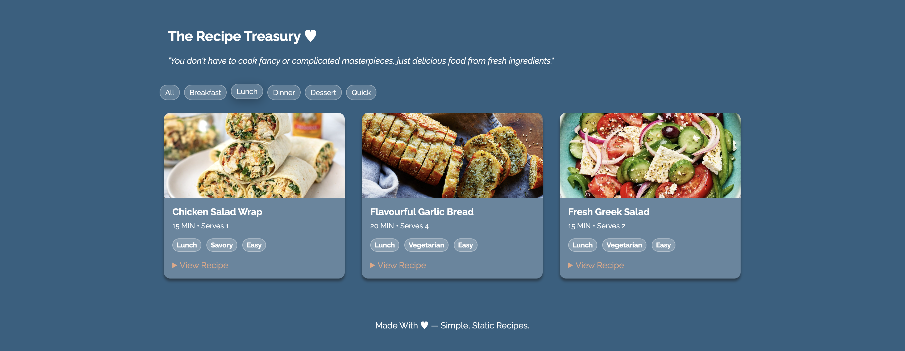

# Recipe Blog | The Recipe Treasury ♥

- A simple, responsive recipe blog built using **HTML** & **CSS**. This project showcases a clean layout design, readable typography and a cozy, user-friendly interface for sharing recipes.
- Perfect for practicing front-end fundamentals and structuring content-focused websites.

---

## Features

- Clean & Minimal Blog Layout
- Individual Recipe Sections With Ingredients & Instructions
- Responsive Design For Desktop & Mobile Screens
- Organized HTML Structure For Easy Readability
- Custom CSS Styling For Colours, Spacing & Typography

---

## Technologies Used

- **HTML5** (Semantic Structure & Content)
- **CSS3** (Layout, Styling & Responsiveness)

---

## Screenshots Of Recipe Blog

### Homepage

### Lunch Recipe Page

---

## How To Run The Project

1. Download Or Clone The Repository
2. Open The Project Folder In **VS Code**
3. Open `index.html` In Your Browser
   *(Right-Click & Select "Open With Live Server" If You Have The Extensions)*

No Extra Program Installations. No Dependencies. Just Tasty Recipes ♥

---

## Purpose Of This Project

This Project Was Created To:
- Practice HTML & CSS Fundamentals
- Improve Page Layout & Visual Hierarchy
- Build A Beginner-Friendly, Portfolio-Worthy Project

---

## Future Improvements

- Add More Recipes
- Include A Navigation Bar
- Improve Mobile Responsiveness
- Add Animations Or More Hover Effects
- Upgrade To JavaScript Or A Framework Later

---

"This project is open for learning and personal use."